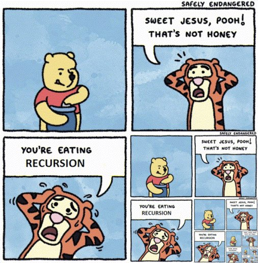
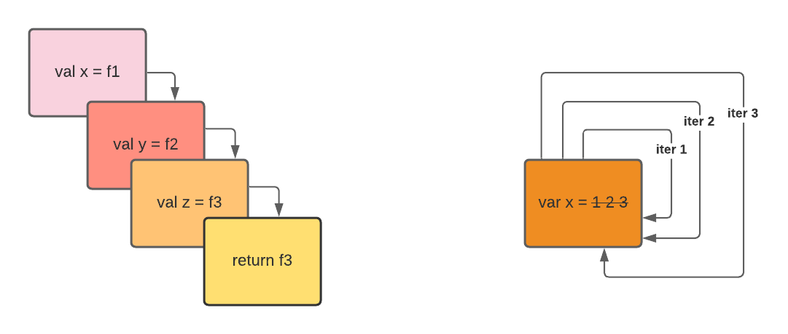

# 101 recursion



The repository review Recursion in the context of Java programming language.

## What is recursion?

Recursion is a programming technique where a function calls itself to solve a problem. It is a way to solve problems by breaking them down into smaller, more manageable parts.

In Java you could process a list using a loop or use a recursive function.



In the repository you will find examples of recursion in Java.

- [x] Simple Java recursion
- [x] Tail Call Optimization (TCO) 
- [x] Memoization
- [x] Divide and Conquer
- [x] Emulate recursion with Java stream API
- [x] Show stack trace

---

### What is Tail Call Optimization (TCO)?

Tail Call Optimization (TCO) is a compiler optimization technique that converts recursive tail calls into iterative loops. A tail call occurs when a recursive call is the last operation in a function.

what is the key benefits of TCO?

- Prevents stack overflow by reusing stack frames
- Improves memory usage and performance
- Turns recursion into iteration under the hood

**Note:** While Java doesn't support TCO natively, other JVM languages like Scala or Kotlin and functional programming languages do.

> In JDK classes [...] there are a number of security sensitive methods that rely on counting stack frames between JDK library code and calling code to figure out who's calling them.

Sournce: https://stackoverflow.com/questions/53354898/tail-call-optimisation-in-java#53354956:~:text=to%20know%20the-,reason,-which%20is%3A

## Concepts

### Tail Recursion

Tail recursion is a special type of recursion where the recursive call is the last operation performed in the function. In other words, there are no pending calculations after the recursive call.

- [Factorial](./src/main/java/info/jab/recursion/Factorial.java)
- [Primes](./src/main/java/info/jab/recursion/Primes.java)

### Memoization

Memoization is a technique used to optimize recursive functions by storing the results of expensive function calls and reusing them when the same inputs occur again.

- [Fibonacci](./src/main/java/info/jab/recursion/Fibonacci.java)

### Divide and Conquer

Divide and Conquer is a recursive algorithmic strategy that breaks down a problem into smaller subproblems until they become simple enough to solve directly.

- [Merge Sort](./src/main/java/info/jab/recursion/MergeSort.java)

## Utils

- [Trampoline](./src/main/java/info/jab/recursion/utils/Trampoline.java)
- [Memoizer](./src/main/java/info/jab/recursion/utils/Memoizer.java)

## How to build in local

```bash
sdk env install
./mvnw clean verify
./mvnw clean verify surefire-report:report
./mvnw clean verify jacoco:report

./mvnw versions:display-dependency-updates
./mvnw versions:display-plugin-updates
```

## References

### Recursion in Java

- https://www.geeksforgeeks.org/recursion-practice-problems-solutions/
- https://medium.com/@johnmcclean/trampolining-a-practical-guide-for-awesome-java-developers-4b657d9c3076
- https://github.com/aol/cyclops 
- https://github.com/bodar/totallylazy

### Recursion in other programming languages

- Clojure: https://clojuredocs.org/clojure.core/recur
- Scala:   https://www.scala-lang.org/api/3.1.2/scala/annotation/tailrec.html
- Kotlin:  https://kotlinlang.org/docs/functions.html#tail-recursion
- Elixir:  https://hexdocs.pm/elixir/main/recursion.html

### Property-Based Testing, PBT

- https://jqwik.net/
- https://github.com/jqwik-team
